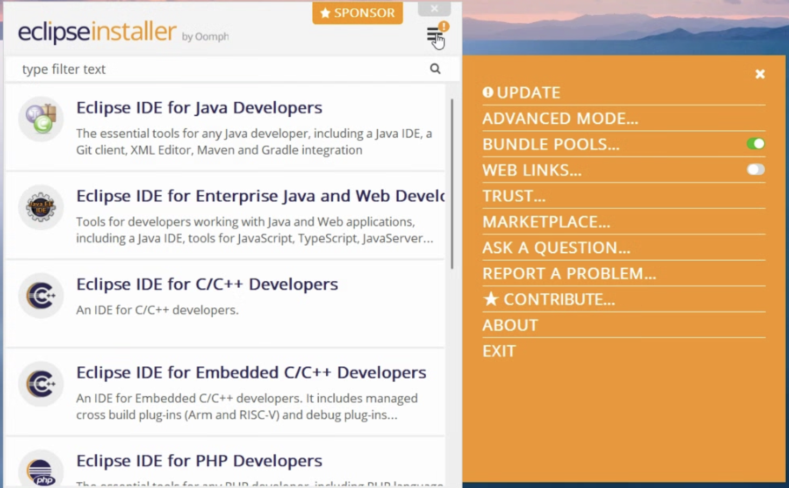
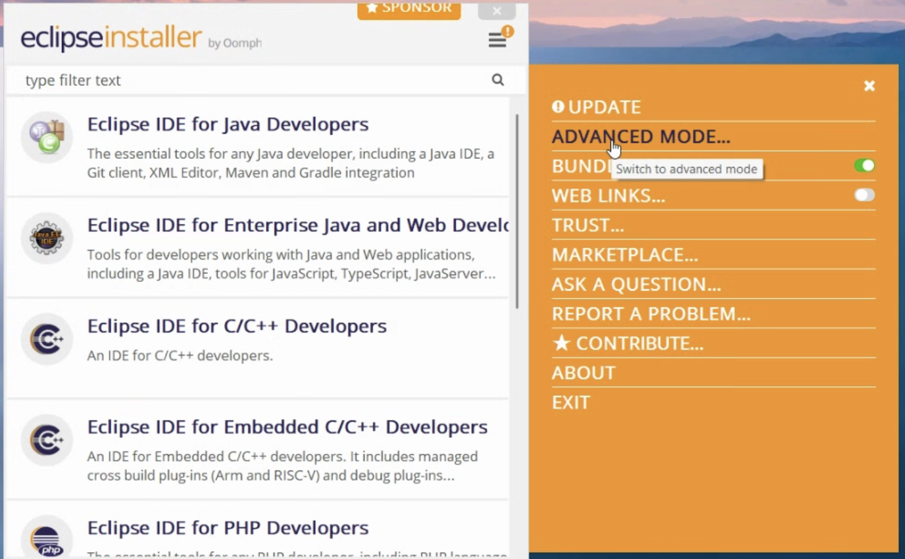
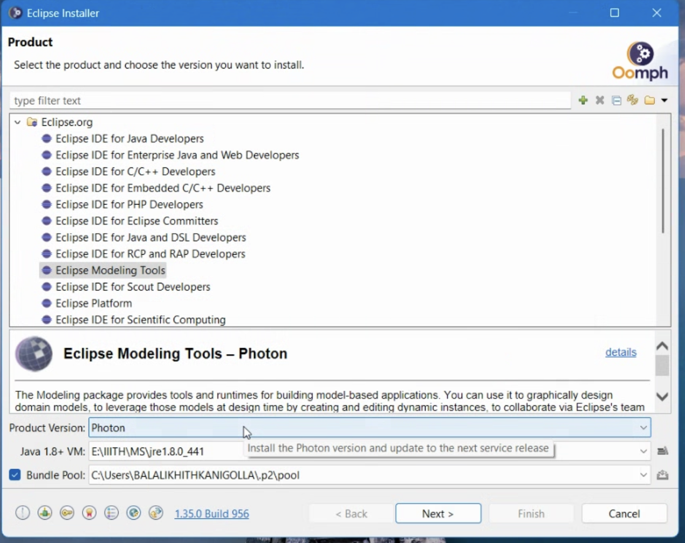

# CAPS Installation Guide

#### Prerequisites

Before proceeding with the installation, ensure that your system meets the following requirements:

- Windows operating system (64-bit)(Tried on Windows expecting same will work for other systems as well)
- Internet connection
- Sufficient disk space (at least 5GB free)

#### Step 1: Download and Install Java 8

1. Visit the [Java SE 8 Downloads page](http://www.oracle.com/technetwork/java/javase/downloads/jre8-downloads-2133155.html).
2. Accept the license agreement and download the Windows x64 JRE.
3. Run the installer and follow the on-screen instructions.
4. Verify the installation by opening the Command Prompt (`Win + R`, type `cmd`, and press Enter) and running: ```sh
    java -version
    ```
    
    Ensure it displays Java 1.8.

#### Step 2: Download and Install Eclipse Modeling Tools

1. Visit the [Eclipse download page](https://www.eclipse.org/downloads/download.php?file=/oomph/epp/2024-12/R/eclipse-inst-jre-win64.exe).
2. Download the Eclipse Installer for Windows (64-bit).
3. Run the installer and select **Advanced Mode**.[ ](http://smartcitylivinglab.iiit.ac.in:4000/uploads/images/gallery/2025-05/image-1746136653464.png)[](http://smartcitylivinglab.iiit.ac.in:4000/uploads/images/gallery/2025-05/image-1746136684270.png)
4. Choose **Eclipse Modeling Tools** as the package.
5. Select the Product version as Photon and proceed with the installation and select the Java 1.8[](http://smartcitylivinglab.iiit.ac.in:4000/uploads/images/gallery/2025-05/image-1746136849882.png)
6. Once installed, launch Eclipse.

#### Step 3: Install EMF

1. Open Eclipse and go to `Help` → `Install New Software`.
2. In the **Work with:** field, select **All Available Sites**.
3. Search for **EMF - Eclipse Modeling Framework**.
4. Check the box for **Eclipse Modeling Framework SDK** and proceed with the installation.
5. Restart Eclipse when prompted.

#### Step 4: Install GMF Tooling

1. Open Eclipse and navigate to `Help` → `Install New Software`.
2. Click on `Add...` and enter the following: 
    - Name: **GMF Tooling**
    - Location: `https://download.eclipse.org/epsilon/updates/gmf-tooling/`
3. Select **GMF Tooling** and click `Next`.
4. Complete the installation and restart Eclipse.

#### Step 5: Install Epsilon

1. Open Eclipse and go to `Help` → `Install New Software`.
2. Click `Add...` and enter: 
    - Name: **Epsilon**
    - Location: `https://download.eclipse.org/epsilon/updates/`
3. Select all the Epsilon components needed and proceed with the installation.
4. Restart Eclipse when prompted.

#### Final Verification

After installation, verify that:

- Java 8 is installed (`java -version` In Command Prompt)
- Eclipse Modeling Tools launches without errors
- EMF, GMF Tooling, and Epsilon are installed under `Help` → `About Eclipse` → `Installation Details`

This completes the setup process. You are now ready to use Eclipse for modeling and development!