# Essentials

This covers a few of the essentials needed. For complete information, please refer to the **CupCarbon**<span class="s1">**®**</span> **User Guide Version U-One 5.1.**

#### **CupCarbon Environment** 

To execute CupCarbon (jar file), use the command window and go to the directory where the jar file is located.

Then execute the following command:

```Powershell
java -jar CupCarbon.jar
```

In the case of the existence of a proxy, use the following command:

```Powershell
java -jar CupCarbon.jar proxy_host_name proxy_number_of_port
```

As shown in the Figure, the CupCarbon Graphical User Interface (GUI) is composed of the following five main

parts:

1. The map (in the center)
2. The menu bar (on the top)
3. The Toolbar (below the menu)
4. The parameter menu (on the left)
5. The state bar (at the bottom)
6. The console (in version 5, the console is separated from the main interface)

[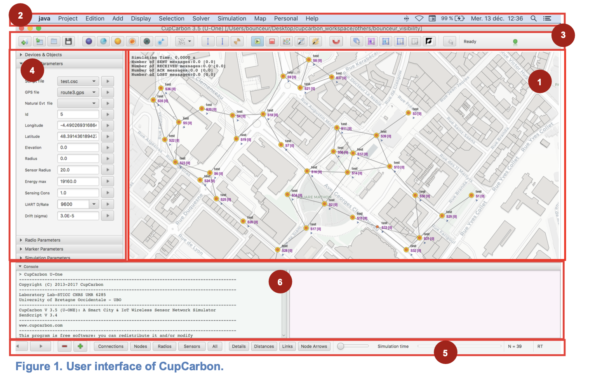](http://smartcitylivinglab.iiit.ac.in:4000/uploads/images/gallery/2025-05/image-1746121356128.png)

#### **The Map**

\- The map is the main object of the simulator CupCarbon. It is the part where the network and the objects of the project can be designed. The map can be changed according to the preference of the user or the way the information must be presented.

[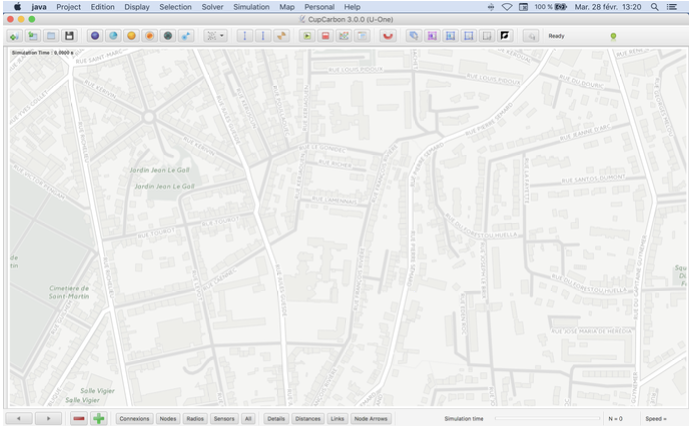](http://smartcitylivinglab.iiit.ac.in:4000/uploads/images/gallery/2025-05/image-1746122754291.png)

The simulation time is displayed on the top left part of the map. During simulation, this time is displayed in red color, and an additional red rectangle is drawn around the map to detect the simulation process (cf. Figure 3 (a)). In this part, other information about the messages is also displayed, including the number of sent, received, ACK, and lost messages. This part can be hidden and displayed using the ALT+D keys.

[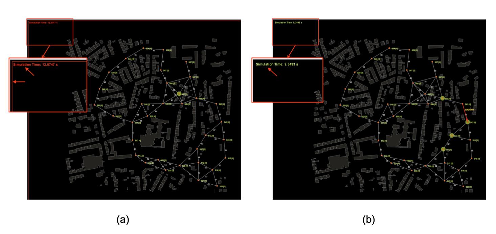](http://smartcitylivinglab.iiit.ac.in:4000/uploads/images/gallery/2025-05/image-1746121522280.png)

#### **The Toolbar**

The toolbar of CupCarbon is used to access the main actions of CupCarbon.

[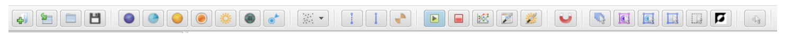](http://smartcitylivinglab.iiit.ac.in:4000/uploads/images/gallery/2025-05/image-1746121635377.png)

It is composed of 7 parts that are:

##### **Project part**

[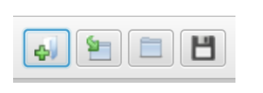](http://smartcitylivinglab.iiit.ac.in:4000/uploads/images/gallery/2025-05/image-1746121669073.png)

It allows creating a new project, opening the last project, opening a project, and saving a project.

##### **Add object part**

[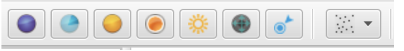](http://smartcitylivinglab.iiit.ac.in:4000/uploads/images/gallery/2025-05/image-1746122046205.png)

It allows adding objects (Sensor node, Directional Sensor node, Base station, Gas, Weather, Mobile, Marker, random sensor nodes) on the map.

**Add Sensor Nodes:** A sensor node is an object that can detect any digital event (motion event like mobiles), send and receive data. It can also be mobile. The visible parameters of a sensor node are: the radio range, the radio of the sensor unit, and the name. A sensor node has many parameters; it can contain many radio modules, a battery, and a sensing unit.

In the center of the sensor node, we find the name S followed by its ID. For example, if its ID is equal to 4, then its name will be S4. In the right part of the name, we find a number situated between brackets, which is equal to \[0\] by default. This number represents the MY address of this sensor node. If a SenScript is assigned to it, it will be displayed in a gray color above its name. The *print* messages will be displayed in blue below their names.

[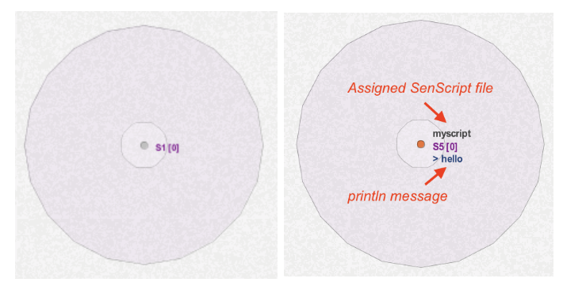](http://smartcitylivinglab.iiit.ac.in:4000/uploads/images/gallery/2025-05/image-1746124214805.png)

A sensor node contains a sensing unit represented by a transparent white circle. The area's radius can be changed using the buttons ‘(’ for increasing the radius and '(‘ for decreasing the radius.

[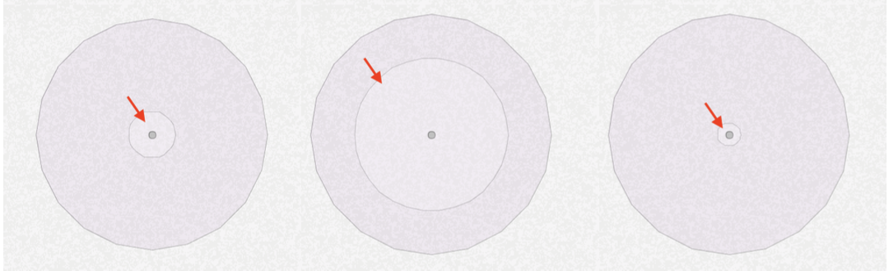](http://smartcitylivinglab.iiit.ac.in:4000/uploads/images/gallery/2025-05/image-1746124259716.png)

**Add Mobiles:** used to simulate mobiles. Markers are also used to create routes followed by mobiles. Each mobile must have its route. They are also used to generate digital events.

[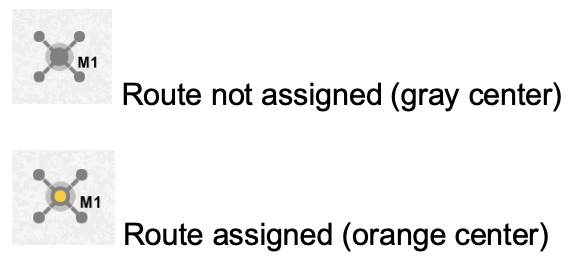](http://smartcitylivinglab.iiit.ac.in:4000/uploads/images/gallery/2025-05/image-1746124314112.png)

A mobile depends on its route (trajectory). This last one is created using markers, as it is explained in the next section, bellow, one needs just to select the route which will be followed by the mobile in the list of created routes from the field GPS file in the Device Parameters view

**Add Markers:** used mainly to generate routes for mobiles (or mobile sensors). They are also used to generate sensor nodes, create new buildings, and indicate the area of generating buildings or random sensor nodes.

[](http://smartcitylivinglab.iiit.ac.in:4000/uploads/images/gallery/2025-05/image-1746122834727.png)

It is possible to generate routes either by drawing the route manually using the markers or by creating just two markers and clicking on the button Route From Markers in the Marker Parameters view. Then, each created route can be saved and added to the list of routes of the project. This procedure is explained above in the Marker Parameters view section. A list of buildings can be added in the area delimited by two markers. It is possible to draw a building by drawing the form using markers and then by typing on the key ‘:’.

[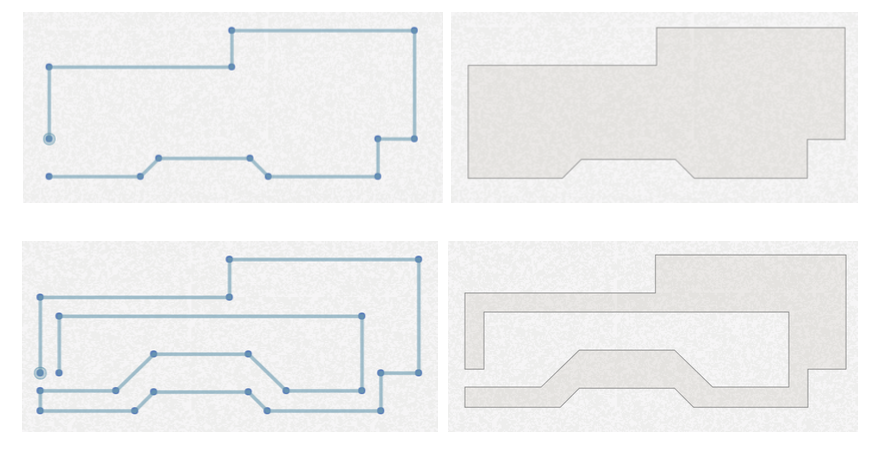](http://smartcitylivinglab.iiit.ac.in:4000/uploads/images/gallery/2025-05/image-1746124426518.png)

##### **Connections part**

[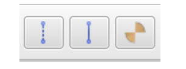](http://smartcitylivinglab.iiit.ac.in:4000/uploads/images/gallery/2025-05/image-1746122054711.png)

It allows for drawing normal or radio propagation-based connections between sensor nodes. It also calculates the visibility of the radio of the sensor node by considering the buildings of a city.

[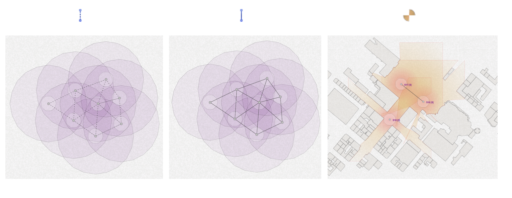](http://smartcitylivinglab.iiit.ac.in:4000/uploads/images/gallery/2025-05/image-1746122095797.png)

##### **Simulation part**

It allows running the simulation, stopping the simulation, drawing the energy consumption function, open the SenScript window and to open the Natural Event generator.

[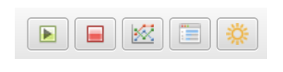](http://smartcitylivinglab.iiit.ac.in:4000/uploads/images/gallery/2025-05/image-1746122103746.png)

**Run Simulation:** to start the simulation

**Stop Simulation:** to stop the simulation

**Energy Consumption:** to display the graph of the energy consumption for the selected sensor nodes once the simulation is finished. You must first check the box *Results* before running the simulation. Two kinds of graphs are possible. The first one shows the state of the battery for the simulation time, and the other one shows the consumption of a sensor for the simulation time.

##### **Magnetism part** [](http://smartcitylivinglab.iiit.ac.in:4000/uploads/images/gallery/2025-05/image-1746122123807.png)

It allows to add objects in an (invisible) grid. It is recommanded to use the map (Mean gray cell background).

##### **Selection part**

[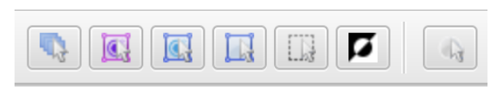](http://smartcitylivinglab.iiit.ac.in:4000/uploads/images/gallery/2025-05/image-1746122168287.png)

It allows to select all, select all sensor nodes, select all markers, select sensor nodes/markers, deselect all, and to invert selection

**Credit: Content taken from CupCarbon<span class="s1">®</span> User Guide Version U-One 5.1**

#### **The parameter panel**

##### **Network information panel**

This panel shows some information about the network, like the number of sensors, the number of marked sensors, the number of isolated sensors, etc.

[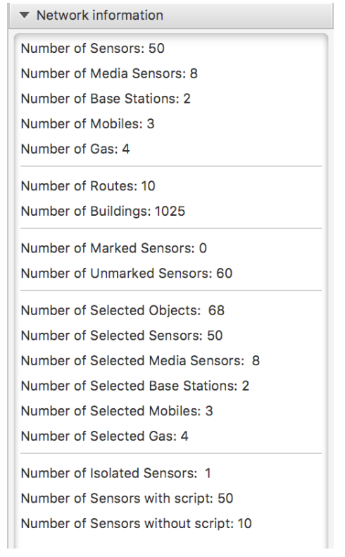](http://smartcitylivinglab.iiit.ac.in:4000/uploads/images/gallery/2025-05/image-1746123424746.png)

##### **Devices &amp; Objects \[Device List\] \[Selection\] panel**

This panel has two tabs. The first one is Device List, which allows you to select an object on the map by its name. The second one is the Selection tab that allows you to select/deselect objects by their type. It is also possible to select objects by their MY addresses or their IDs. These addresses/IDs can be entered as a list of numbers in the corresponding text field.

[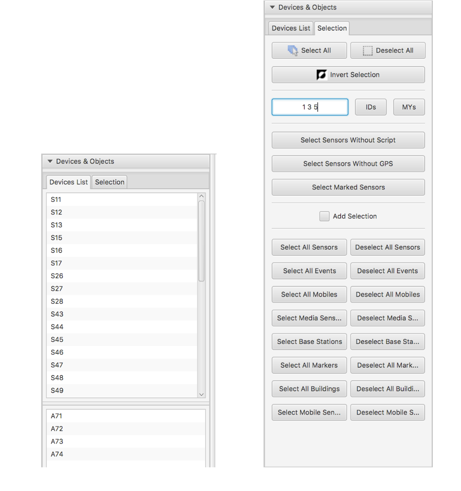](http://smartcitylivinglab.iiit.ac.in:4000/uploads/images/gallery/2025-05/image-1746123448323.png)

##### **Device Parameters panel**

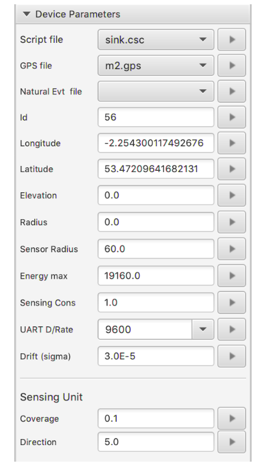

This panel allows you to modify the parameters of the selected objects, like:

1. Script file: to assign the SenScript file
2. GPS File: to assign the route file
3. Natural Event File: to assign the natural event file generated from the Natural Event generator
4. Id: to assign an ID
5. Longitude: to assign a longitude
6. Latitude: to assign a latitude
7. Elevation: to assign an elevation
8. Radius: to assign a radius for the sensor node (this is not the radio radius)
9. Sensor Radius: to assign a radius for the sensing unit
10. Energy max: the initial energy of the battery
11. Sensing consumption: the sensing consumption in units (it is not considered in this version of CupCarbon)
12. UART Datarate: the UART datarate, which represents the necessary time to send data (bytes) to the buffer of the radio module.
13. Drift (sigma): the clock drift.
14. The coverage of a sensing unit (case of directional sensor node)
15. The direction (rotation) of a sensing unit (case of directional sensor node)

Any modification is considered only if it is followed by a click on the apply button with the right gray arrow situated in the right part of the corresponding field.

##### **Radio Parameters panel**

This panel allows for modifying the parameters of the radio module of the selected sensor nodes. From this, we mainly use Radius: the radius range of the selected radio module. In the propagation mode (when clicking on the icon of the state bar) is activated than this radius is calculated automatically depending on the signal propagation and the environment.

##### **Marker Parameters panel**

[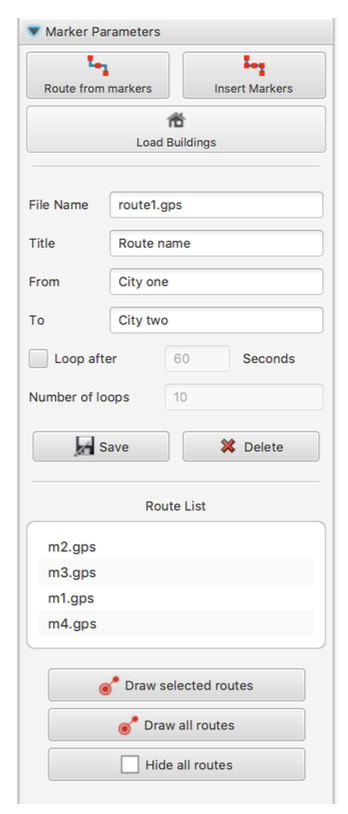](http://smartcitylivinglab.iiit.ac.in:4000/uploads/images/gallery/2025-05/image-1746123620555.png)

This panel allows for working with the markers as follows:

1\. Route from markers: This button allows you to generate a route situated between two points of the map that are determined by two markers. If there are more than 2 markers, only the last two will be considered. This allows for drawing new routes as a continuation of the existing one.

[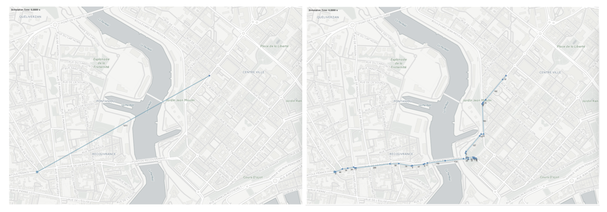](http://smartcitylivinglab.iiit.ac.in:4000/uploads/images/gallery/2025-05/image-1746123668469.png)

2\. Insert Markers: allows to insertion of markers after the selected ones (cf. Section Markers). The same result can be obtained by pressing the key ‘u’.

##### **Simulation Parameters and SenScript Panel**

[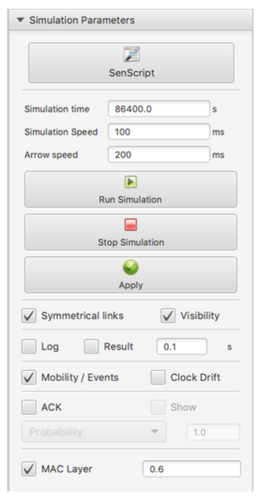](http://smartcitylivinglab.iiit.ac.in:4000/uploads/images/gallery/2025-05/image-1746123744752.png)

This panel is used for the simulation. It contains the following buttons and options:

**SenScript:** to open the SenScript window

**Simulation time:** the duration of the simulation

**Simulation Speed:** is the speed of the simulation. The objective of this button is to be able to follow and to visualize the simulation at human speed. It is useful for debugging.

**Arrow speed:** the same as the Speed function, where the delay in this option is related to the sending/receiving message. It allows for to visualization of the messages.

**Run simulation:** start the simulation (can also be done by pressing on Entree)

**Stop Simulation:** stop the simulation