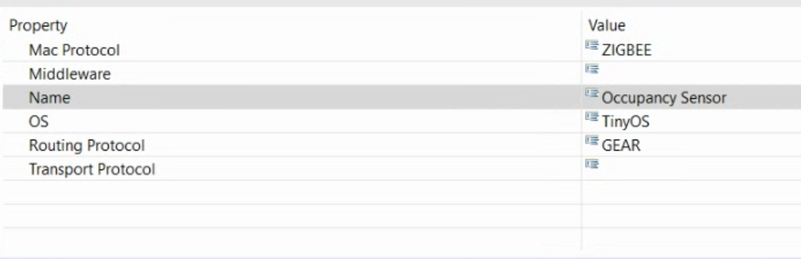
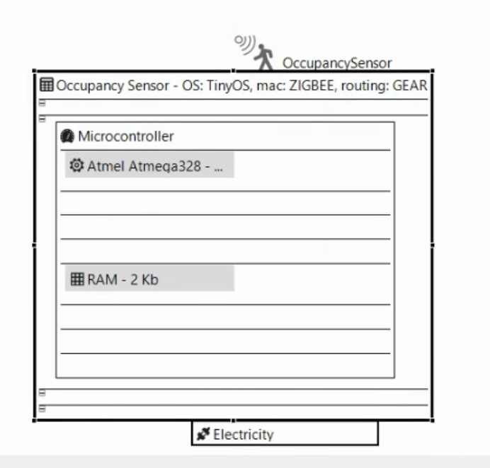

# Hardware Modeling Language (HWML) Guide

## Introduction to HWML

The Hardware Modeling Language (HWML) is a framework designed to model the hardware components of a system. It allows users to define deployment nodes, microcontrollers, processors, memory, energy sources, and various sensors. This guide provides a detailed step-by-step process for modeling hardware using HWML.

### Step 1: Creating a New HWML Model

1. Open Eclipse and navigate to `Project Explorer`.
2. Right-click on the `model` folder.
3. Select `New` → `Other`.
4. In the dialog box, search for **CAPShwml Model**.
5. Click `Next`, then provide a name for the model (ensure it ends with `.capshwml`).
6. Click `Next` again and choose **Node Specification**.
7. Click `Finish` to create the HWML model file.

### Step 2: Initializing the HWML Diagram

1. Locate the newly created `.capshwml` file in the `Project Explorer`.
2. Right-click the file and select `Initialize Filesystem Diagram`.
3. Enter a name for the diagram or keep the default name.
4. Click `Finish` to generate the diagram workspace.

## Defining Hardware Components

### Step 3: Creating a Deployment Node

1. Open the `Palette` view on the right-hand side of Eclipse.
2. Select the **Node** element and place it onto the canvas.
3. In the `Properties` view, set the following attributes: 
    - **Mac Protocol**: ZIGBEE (standard communication protocol)
    - **Name**: Occupancy Sensor
    - **OS**: TinyOS (embedded operating system for wireless devices)
    - **Routing Protocol**: GEAR (Geographical Energy Aware Routing)

### Step 4: Adding a Microcontroller

1. From the`Palette`, select **Microcontroller**.
2. Place it inside the previously created Node.
3. This represents the microcontroller managing the sensor and data processing.

### Step 5: Adding a Processor

1. Select **Processor** from the `Palette`.
2. Place it inside the **Microcontroller**.
3. Set the following attributes in the `Properties` view: 
    - **CPI (Clocks Per Instruction)**: 1.0
    - **Frequency**: 120 MHz
    - **Name**: Atmel Atmega328

### Step 6: Adding Volatile Memory (RAM)

1. Select **Volatile Memory** from the `Palette`.
2. Place it inside the **Microcontroller**.
3. Set the following properties: 
    - **Name**: RAM
    - **Size**: 2 KB

### Step 7: Adding an Energy Source

1. Select **Continuous Energy Source** from the `Palette`.
2. Place it inside the **Node**.
3. Set the **Name** to `Electricity` (indicating a continuous power source).

### Step 8: Adding a Sensor

1. Select **Occupancy Sensor** from the `Palette`.
2. Place it inside the **Node** to model the actual occupancy-sensing component.

**Final Diagram:**

