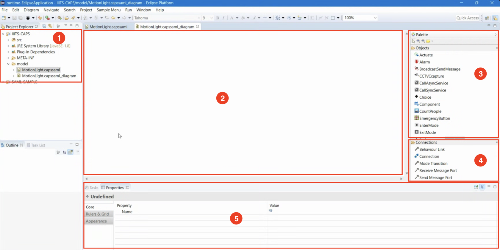
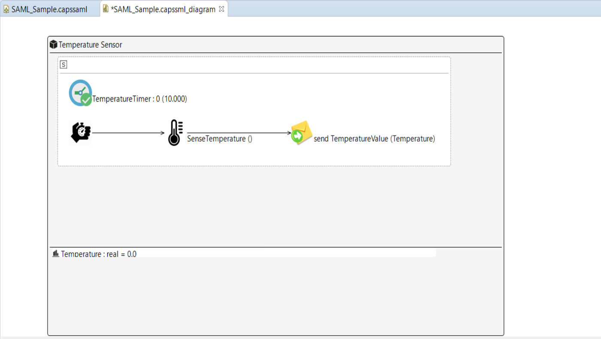
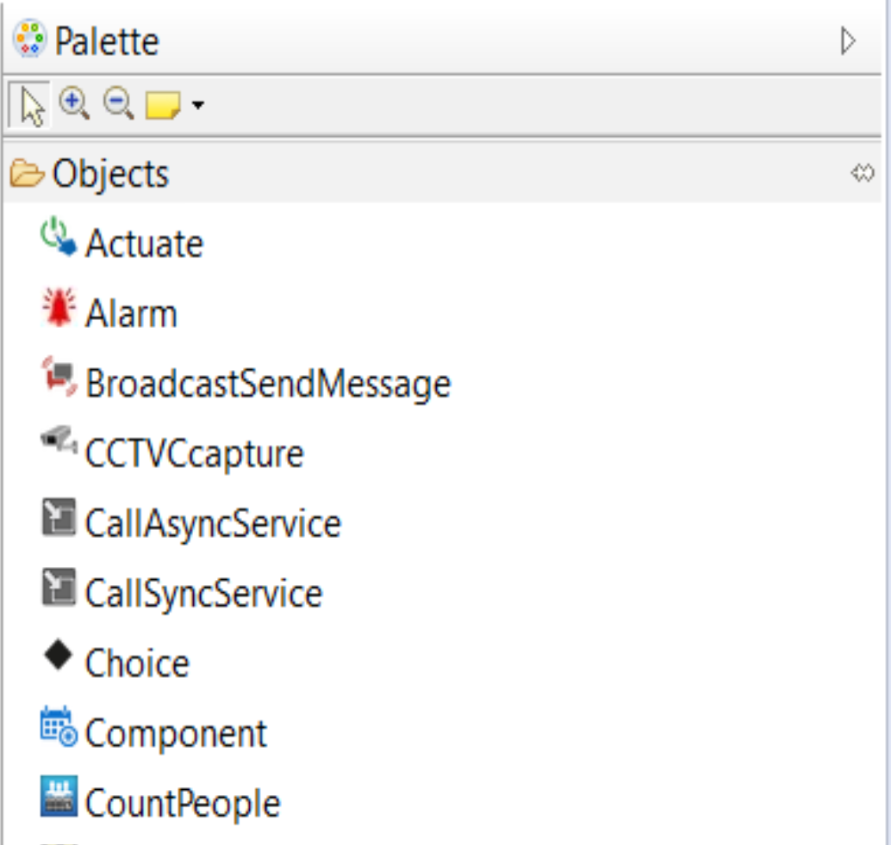
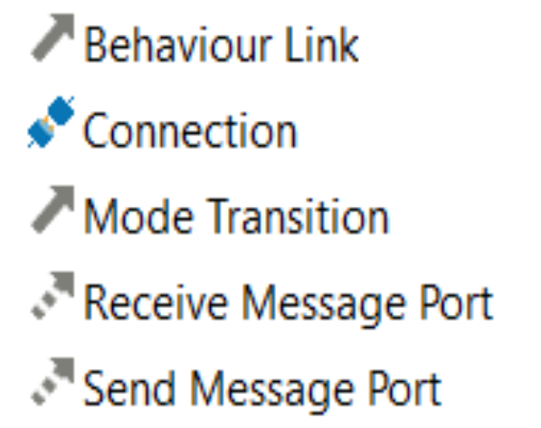
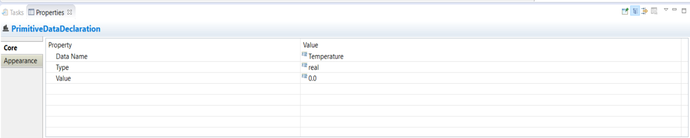

# SAML (Software Architecture Modeling Language) Guide

## Overview

SAML (Software Architecture Modeling Language) is used to model and simulate software architectures, particularly in IoT-based scenarios. It allows users to define components, interactions, and behaviors in a structured manner. This guide provides a step-by-step approach to using SAML for designing a temperature sensor-based automation system.

### CAPS Environment in Eclipse

1. Folder Viewer (on the left)
2. Diagram Canvas (in the center)
3. Pallate(on the right)
4. Connections(on the right)
5. Properties Panel(at the bottom)

##### **Folder Viewer**

This displays the file structure. It contains your SAML project, and there is a folder called ‘model’ where you can create your SAML models.

##### **Diagram Canvas**

Items can be taken from the palette and connections to model our SAML.

##### **Pallate**

Pallate contains all the components required for the architecture, such as sensors, timers etc

##### **Connections**

Types of connections between the components can be selected from here.

##### **Properties**  

Configure the properties of the components used for modelling,

