# Simulate Motion Based Lighting System in Cup Carbon

Open the CupCarbon and create the project:

[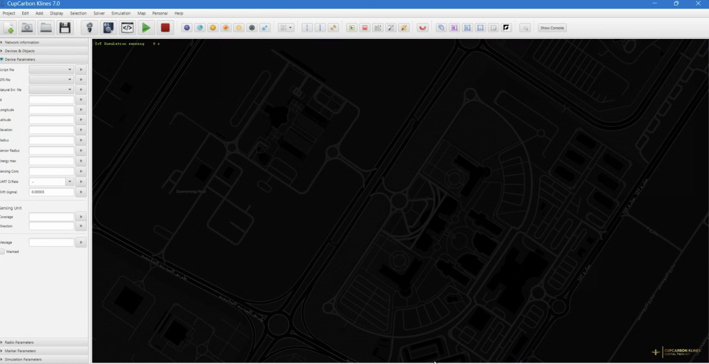](http://smartcitylivinglab.iiit.ac.in:4000/uploads/images/gallery/2025-05/image-1746124617257.png)

Now, go to the map and select the Notebook view:

[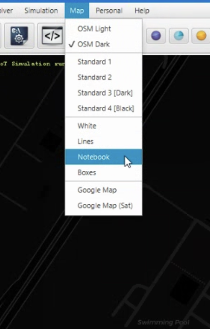](http://smartcitylivinglab.iiit.ac.in:4000/uploads/images/gallery/2025-05/image-1746124825997.png)

[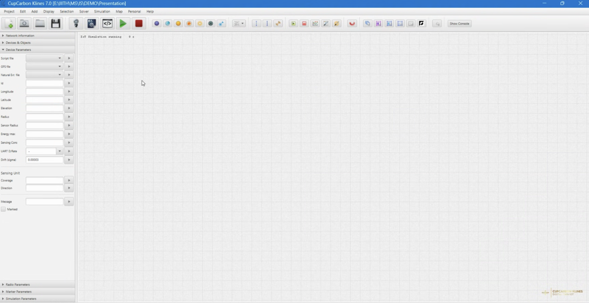](http://smartcitylivinglab.iiit.ac.in:4000/uploads/images/gallery/2025-05/image-1746124873209.png)

Feel free to explore and select the other views as well.

Now, let’s create the base path using markers. From the toolbar, select the icon with the sky-blue circle and an arrow, or you can also use the shortcut key number 8. Now you can see the **+** icon start clicking and draw the path, once you are done right click the mouse.

[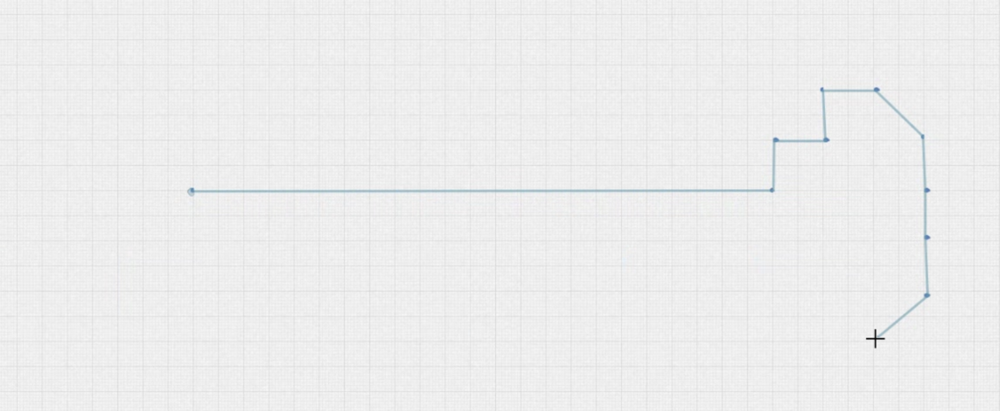](http://smartcitylivinglab.iiit.ac.in:4000/uploads/images/gallery/2025-05/image-1746125513108.png). [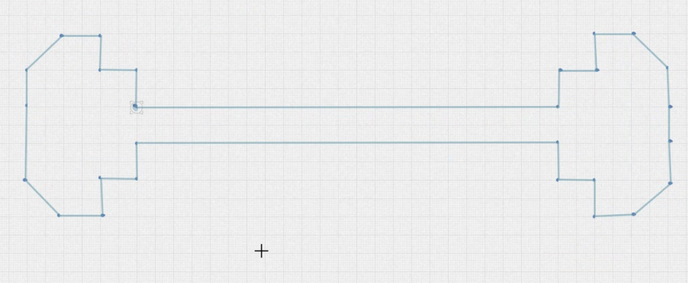](http://smartcitylivinglab.iiit.ac.in:4000/uploads/images/gallery/2025-05/image-1746125730533.png)

Once you get a base shape, it’s time to add more markers. These act as steps in the simulation, so the mobile node travels one dot per the given arrow speed. To start, click on the marker and keep pressing '**u**'.

[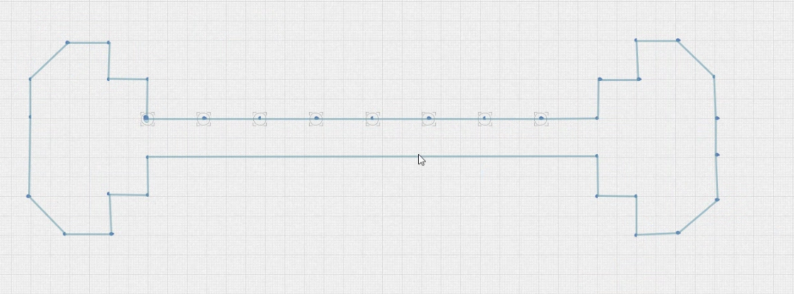. ](http://smartcitylivinglab.iiit.ac.in:4000/uploads/images/gallery/2025-05/image-1746125948573.png) [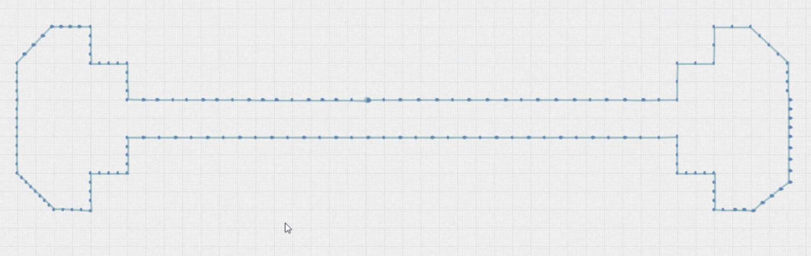](http://smartcitylivinglab.iiit.ac.in:4000/uploads/images/gallery/2025-05/image-1746125985310.png)

Add as many markers as you need, you can draw any shape, or you can choose map view and draw to points and click **Route From Markers** from the **Marker Parameters** section in the slide bar.

[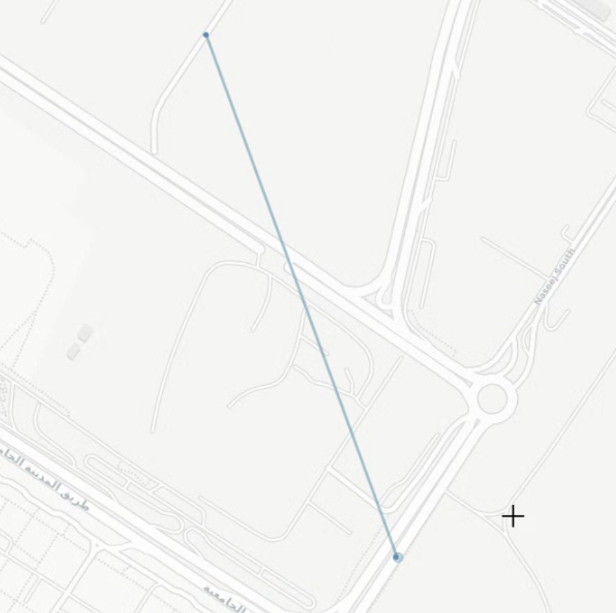. ](http://smartcitylivinglab.iiit.ac.in:4000/uploads/images/gallery/2025-05/image-1746126165261.png)[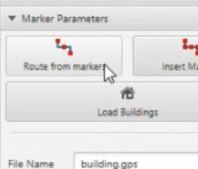 ](http://smartcitylivinglab.iiit.ac.in:4000/uploads/images/gallery/2025-05/image-1746126207552.png) [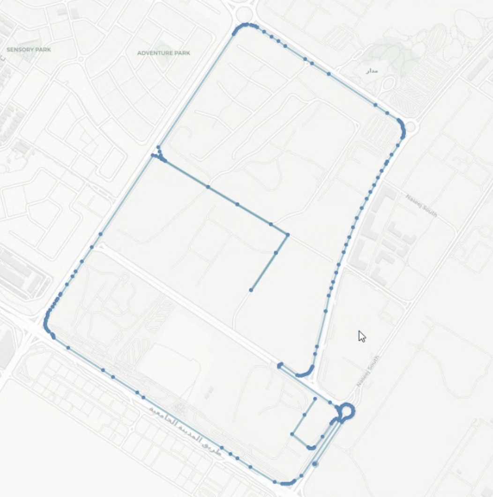](http://smartcitylivinglab.iiit.ac.in:4000/uploads/images/gallery/2025-05/image-1746126259549.png)

Save the markers drawn as the route from the side menu.

[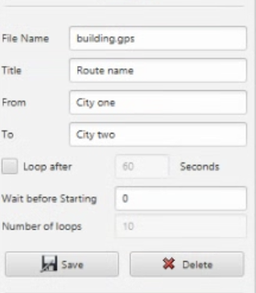](http://smartcitylivinglab.iiit.ac.in:4000/uploads/images/gallery/2025-05/image-1746126448425.png)

Now, it’s time to add some sensor nodes. We will be using a total of three types: sensor node, IoT node, and mobile node. We will create two types within the sensor node: one for the controller and one for the sensor. to add the sensor node click on the purple circle from the toolbar or use the shortcut key '**1**'.

[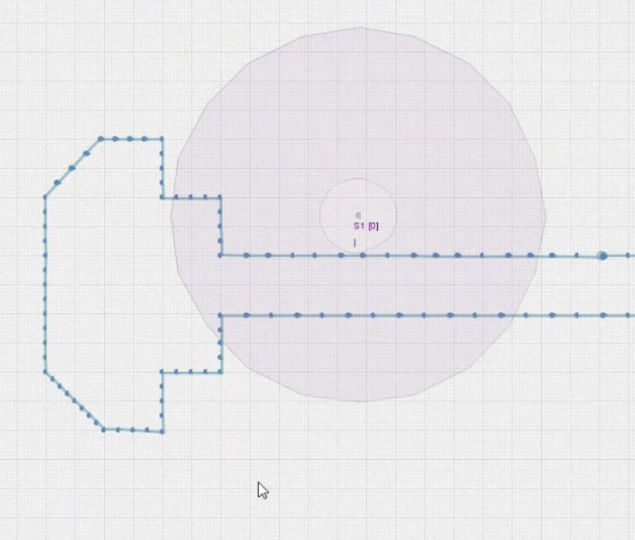](http://smartcitylivinglab.iiit.ac.in:4000/uploads/images/gallery/2025-05/image-1746126694009.png)Let's now go deeper and make this a sensor node that is supposed to detect the activity. As this sensor will be placed on the path, we created the inner circle should be on the points of the so we will reduce the radius to **20** and then also will keep the radio radius **20**. Because keeping this bigger causes the other nearby sensors to be connected. We want the lights to be turned on only when the user is at that point. The same process will be followed for the controller/router. The difference between the sensor and the controller/router is sensor takes the readings, and the controller will forward the readings to the nearby nodes.

[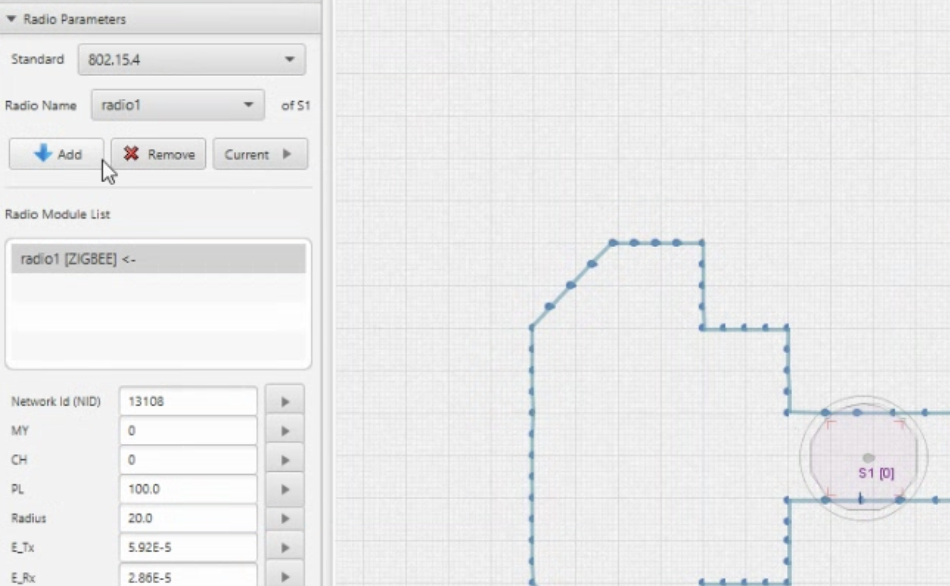](http://smartcitylivinglab.iiit.ac.in:4000/uploads/images/gallery/2025-05/image-1746127149612.png)

To make it alive, we need logic. So, click on the **SenScript Window** and add the code for both the sensor and the controller.

[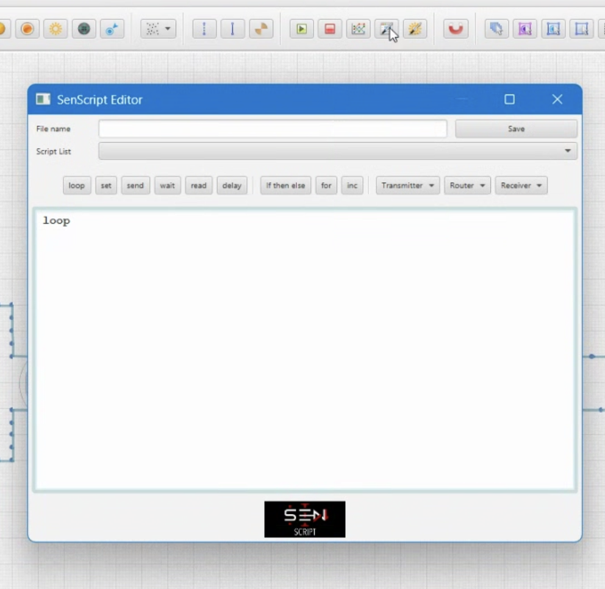](http://smartcitylivinglab.iiit.ac.in:4000/uploads/images/gallery/2025-05/image-1746127361863.png)

First, we will add the sensor code:

```csc
atget id id
loop
dreadsensor x
data message id x
send message 0 2
delay 1000
```

- **atget id id** → id = id, my or ch of the sensor node
- **loop** → Starting the loop section
- **dreadsensor x** → x=1 if the sensor detects an event (mobile), x=0, otherwise
- **data message id x** → This line prepares a **data message** to be sent. It packages the data gathered from the sensor (`x` is the data being read), and associates it with the **ID** of the node (`id`). This message will be sent to another node or system.
- **send message 0 2** → This sends the message from the sensor node to all nodes within its range. The **ID** of the node is set to **2** (this should be configured in the panel for the controller node). By doing this, we can **broadcast** the message to all nodes within range. If we hardcode the ID for each node, we would have to manually change it for every single node, which is inefficient. Broadcasting the message allows for dynamic communication across the network.
- **delay 1000** → This introduces a **delay** of 1000 milliseconds (1 second).

and save it with the extension **csc**.

For the controller/router node:

```
atget id id
loop
wait 
read message
rdata message rid x
data message2 id x
send message2 * rid
```

- **atget id id** → id = id, my or ch of the sensor node
- **loop** → Starting the loop section
- **wait** → wait for the message
- **read message** → reads the message sent
- **rdata message rid x**→ This command extracts data from the **received message** (stored in `message`).  
    The message is assumed to be a string formatted with fields separated by `#`.
    
    
    - It splits the message into parts.
    - The first part is assigned to **`rid`** (the sender’s ID).
    - The second part is assigned to **`x`** (the data payload).
- **data message2 id x**→This line prepares a **data message** to be sent. It packages the data gathered from the sensor
- **send message2 \* rid**→ Sends `message2` to **all nodes in range of `rid`** (the original sender).  
    The `*` indicates broadcasting to all nodes within range of `rid`.

Finally, we will write the logic for the reciving node(IoT node):

```
loop 
wait 
read message
rdata message rid x

if(x==1)
	print "Detected"
	mark 1
else
	print "Not Detected"
	mark 0
end

```

- **loop** → Starting the loop section
- **wait** → wait for the message
- **read message** → reads the message sent
- **rdata message rid x**→ This command extracts data from the **received message** (stored in `message`).  
    The message is assumed to be a string formatted with fields separated by `#`.
    
    
    - It splits the message into parts.
    - The first part is assigned to **`rid`** (the sender’s ID).
    - The second part is assigned to **`x`** (the data payload).
- **if condition** → This condition checks if the value received is 1 or not, if 1 it prints Detected and turn on the node else prints Not Detected and keeps the node off or turn the node off.

After adding the one more node and a IoT node(This can be added using the bulb icon in the toolbar), the screen looks like this:

[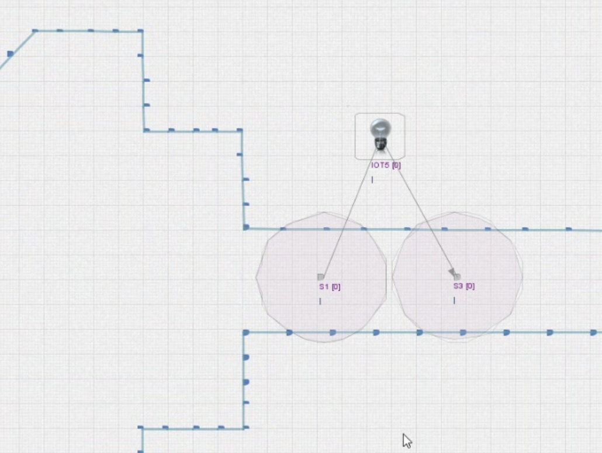](http://smartcitylivinglab.iiit.ac.in:4000/uploads/images/gallery/2025-05/image-1746132760352.png)

Arrows will be automatically added as the nodes are with in the range of the radio of the IoT node by default. now we have to assign the scripts to the nodes to make bring our model to the life.

Now i will assign the sensor script to the node id S1 and the router script to the S3(this can be any node number) and to the IOT node my final receving script, to do this i will click on the node and then go to the **Device Parameters** section and select the respective script file.

[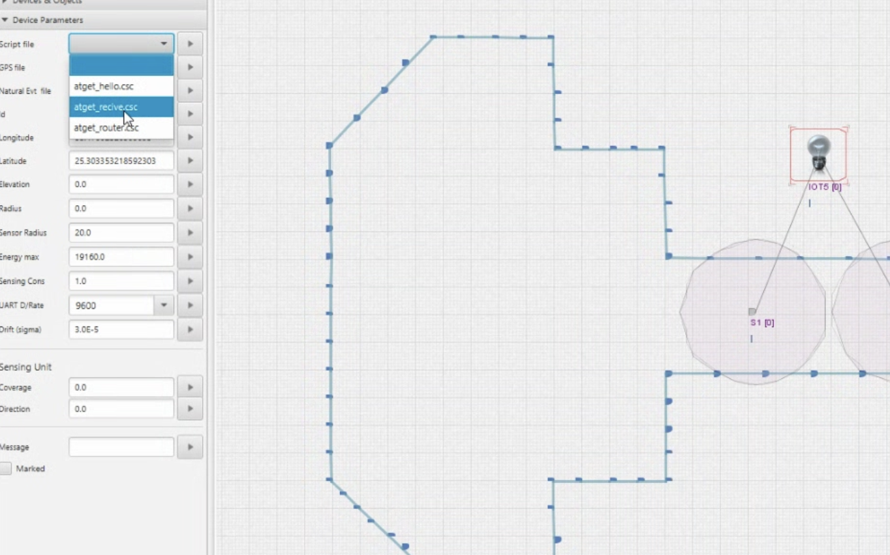](http://smartcitylivinglab.iiit.ac.in:4000/uploads/images/gallery/2025-05/image-1746133107495.png)

[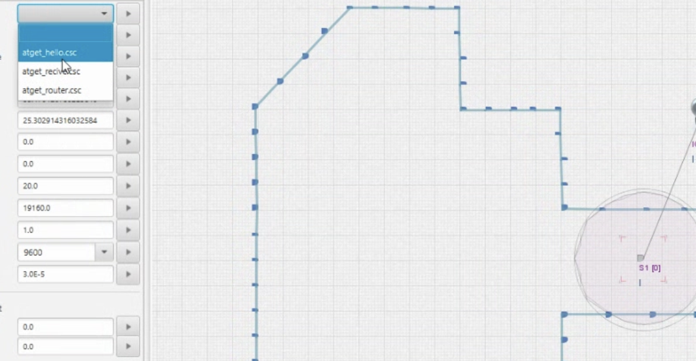](http://smartcitylivinglab.iiit.ac.in:4000/uploads/images/gallery/2025-05/image-1746133142892.png)

[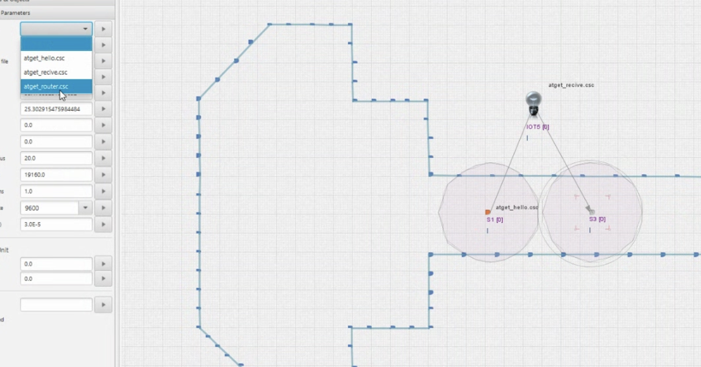](http://smartcitylivinglab.iiit.ac.in:4000/uploads/images/gallery/2025-05/image-1746133170702.png)[](http://smartcitylivinglab.iiit.ac.in:4000/uploads/images/gallery/2025-05/image-1746133705713.png)

Make sure you also **set the MY value in the Radio Parameter to 2 for router node only.** After Assigning screen looks like this, confirm that scripts are loaded. The name of the loaded script will be shown in the side. we now add the mobile node and assign the gps file only to it(the orange dot indicates the gps file is added to it).

[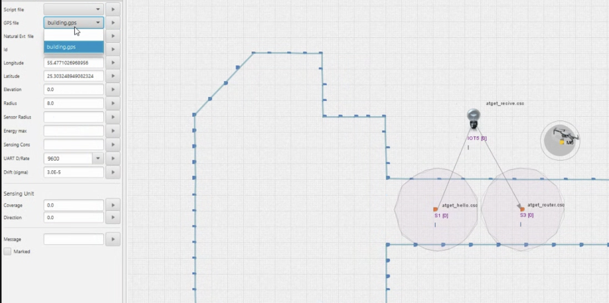](http://smartcitylivinglab.iiit.ac.in:4000/uploads/images/gallery/2025-05/image-1746133429981.png)

Now its time to run the simulation. Click on the main simulation button, once started then to make the mobile node running go to the **Simulation Parameters** and run the simulation. **Also, ensure that the router is connected to the sensor, if not move it close.**

[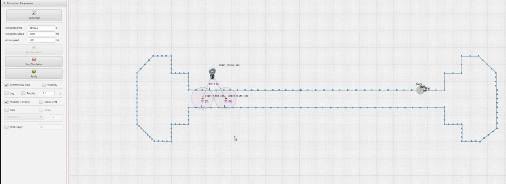](http://smartcitylivinglab.iiit.ac.in:4000/uploads/images/gallery/2025-05/image-1746133545332.png)

[](http://smartcitylivinglab.iiit.ac.in:4000/uploads/images/gallery/2025-05/image-1746133937843.png)[ ](http://smartcitylivinglab.iiit.ac.in:4000/uploads/images/gallery/2025-05/image-1746133887095.png)

Now lets add more routers, lights and check our dynamic code logic.

[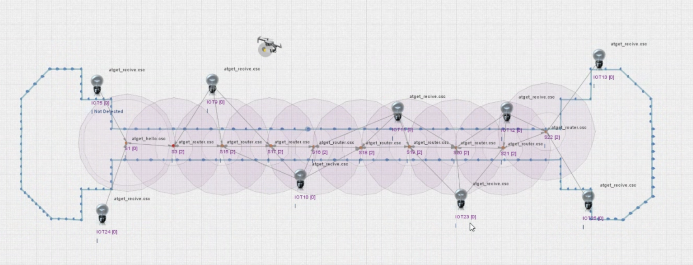](http://smartcitylivinglab.iiit.ac.in:4000/uploads/images/gallery/2025-05/image-1746134370001.png)

Now i multplied the router nodes keeping the single sensor node and all the bulbs are conncected to the router nodes, so whenever there is a moment at the sensor node all the bulbs will get turned on. From the sensor the information will be sent to the bulbs through the routers.

[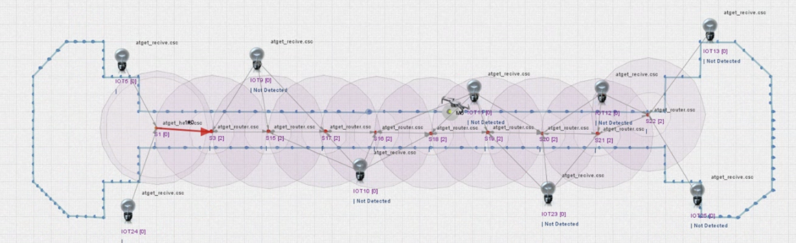](http://smartcitylivinglab.iiit.ac.in:4000/uploads/images/gallery/2025-05/image-1746134592129.png)

[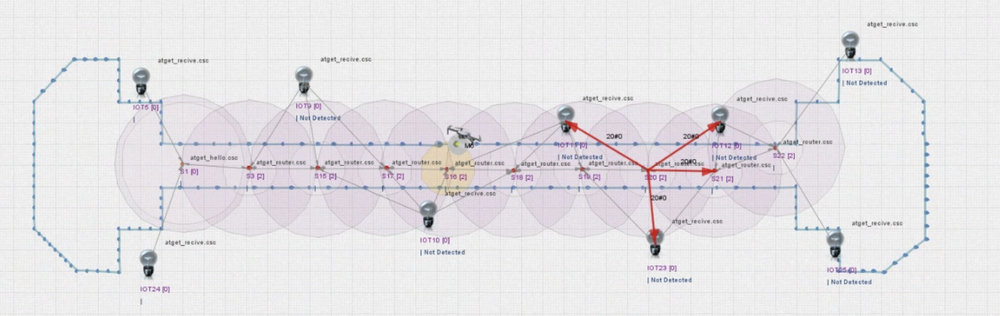](http://smartcitylivinglab.iiit.ac.in:4000/uploads/images/gallery/2025-05/image-1746134558242.png)

[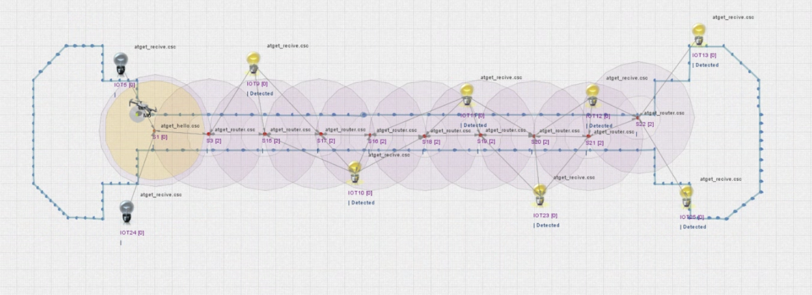](http://smartcitylivinglab.iiit.ac.in:4000/uploads/images/gallery/2025-05/image-1746134504119.png)

To make this more intresting, we can multiple the sensor nodes and the router nodes where the one sensor node will send the information to only one router and the router will send the information to the nearby bulbs, This simulates the motion based lighting. Here is the complete example:

[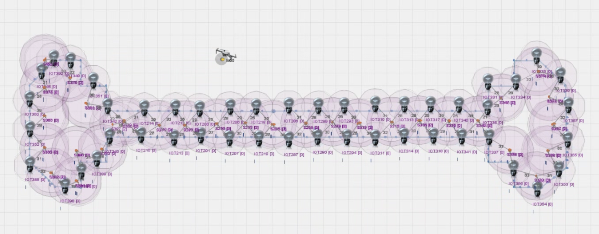](http://smartcitylivinglab.iiit.ac.in:4000/uploads/images/gallery/2025-05/image-1746134856140.png)

Hiding all the details, it will look like this

[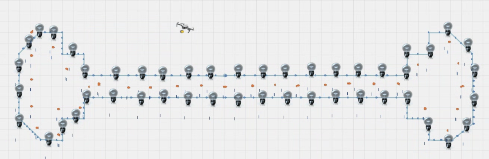](http://smartcitylivinglab.iiit.ac.in:4000/uploads/images/gallery/2025-05/image-1746134912072.png)

During Simulation:

[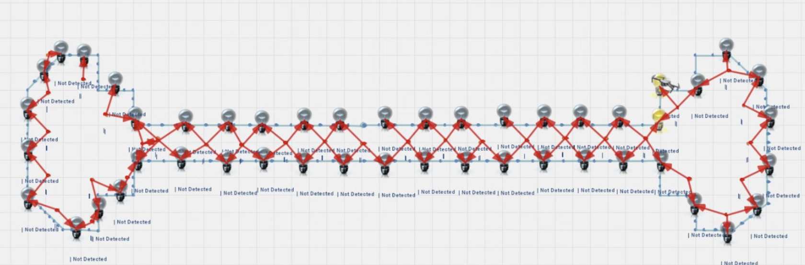](http://smartcitylivinglab.iiit.ac.in:4000/uploads/images/gallery/2025-05/image-1746134944901.png)

[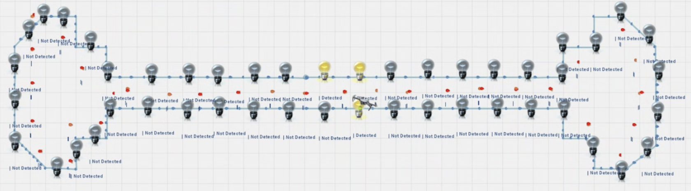](http://smartcitylivinglab.iiit.ac.in:4000/uploads/images/gallery/2025-05/image-1746134970160.png)

All the redlines indicate the data flow between the nodes. Now the whenever the mobile node is detected it will send the information to the router and the router sends to the nearby bulbs on command.

The cup carbon code files for the shown example can be found at: [https://github.com/likhithkanigolla/IIITS-Demo/tree/main/FinalCupCarbon-Demo](https://github.com/likhithkanigolla/IIITS-Demo/tree/main/FinalCupCarbon-Demo)