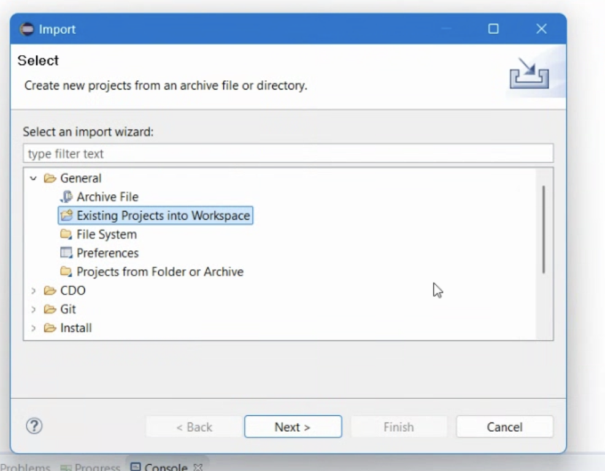
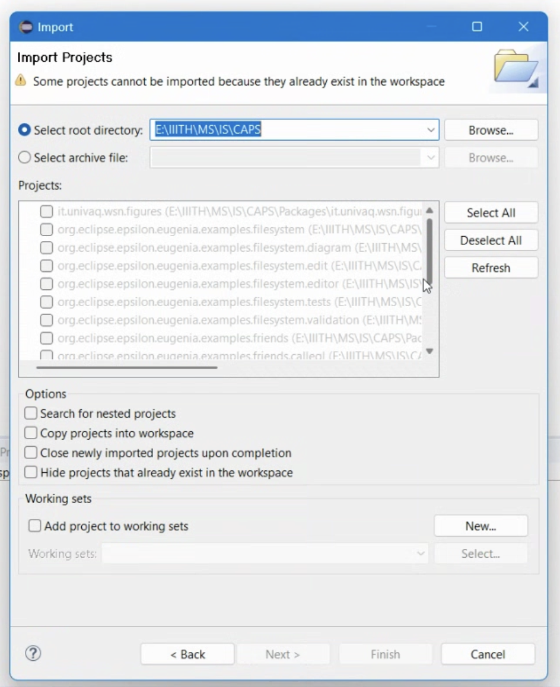
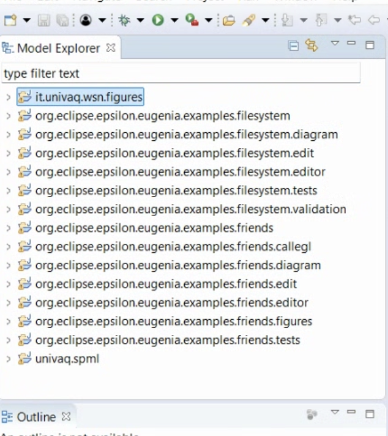
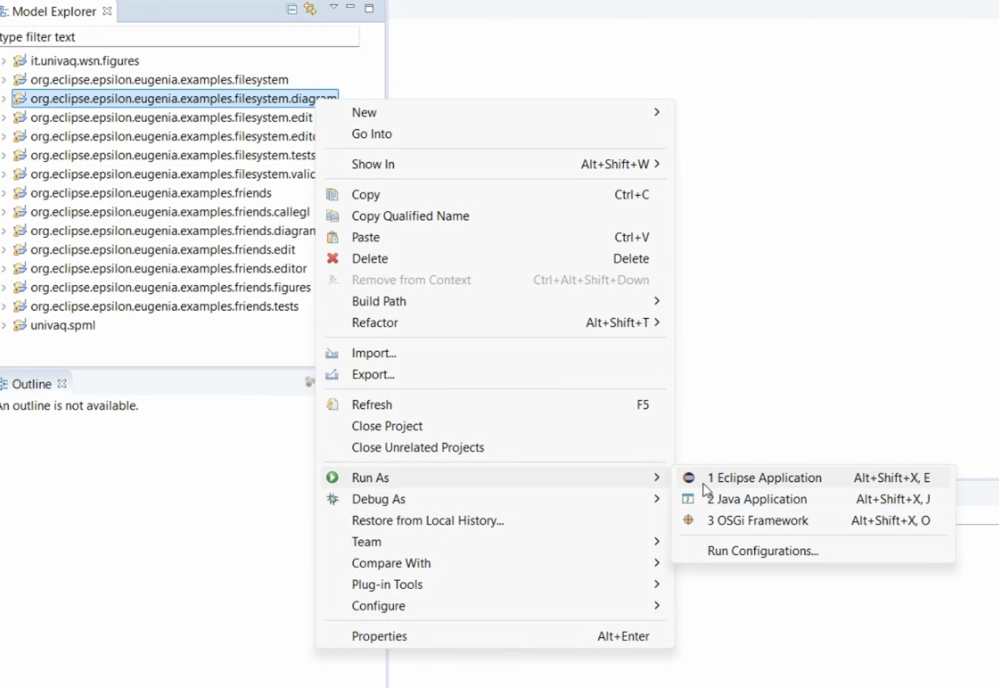

# Eclipse CAPS Integration Guide

#### Step 1: Download the CAPS Project Files

1. Obtain the latest CAPS project archive (`CAPS.7z`) from the official repository or provided link: [Download CAPS.7z](https://www.dropbox.com/scl/fi/7e7rbncdevxn3byf1c8iz/CAPS.7z?rlkey=mgayc4tzsqo9tsi2s54ojqqw4&e=1&dl=0)
2. Save the file to a preferred location (e.g., `C:\CAPS`).
3. Extract the contents of `CAPS.7z` using a tool like WinRAR, 7-Zip, or Windows Explorer.
4. Ensure the extracted folder contains a `Packages` directory with the required Eclipse projects.

#### Step 2: Import Projects into Eclipse

1. Open Eclipse.
2. Navigate to `File` → `Import`.
3. Select `General` → `Existing Projects into Workspace` and click `Next`
4. Click `Browse` and select the extracted `Packages` folder.
5. Ensure all projects are selected in the list.
6. Click `Finish` to import the projects into your workspace.

#### Step 3: Configure the Workspace

##### Run the Diagram Editor

1. In the `Project Explorer`, locate the project `org.eclipse.epsilon.eugenia.examples.friends.diagram`.
2. Right-click on the project and select `Run As` → `Eclipse Application`.
3. A new Eclipse instance will launch, allowing you to work with the modeling environment.

At this point, the CAPS framework should be successfully imported and ready for use in Eclipse.