# SAML for Motion Based Lighting System

### Project Description

This project implements an automated motion detection and response system using a sensor-controller-actuator architecture. A **motion sensor** continuously monitors for movement within its detection range. Upon detecting motion, the sensor transmits a signal to a **controller** (or router) responsible for processing the incoming data. The controller analyzes the signal and, based on predefined logic, sends a command to a **light actuator** to turn the light on. This system enables responsive, energy-efficient lighting by automating illumination based on occupancy or movement detection, making it ideal for smart home or smart building applications.

#### Motion Sensor

1. Detects Motion every second
2. Sends the data to the controller/router

#### Controller/Router

1. Waits for the message to receive
2. Look for the available nodes/lights
3. Sends the message

#### Sensor/Light

1. Receives the message.
2. checks if it's 1 or 0.
3. Turn on/off the light based on the condition.

### Steps to Create a SAML Project

#### 1. Create a New SAML Project

1. Open Eclipse and go to `File` → `New` → `Project`.
2. Select `EMF` → `Empty EMF Project`.
3. Name the project and select a location (keeping the default workspace location is recommended).
4. Click `Finish`.

#### 2. Create the SAML Model File

1. In the **Project Explorer**, expand the newly created project.
2. Right-click on the `model` folder, select `New` → `Other`.
3. Search for `CAPSModel` and select `CAPSSaml`.
4. Name the file, ensuring it ends with `.capssaml`[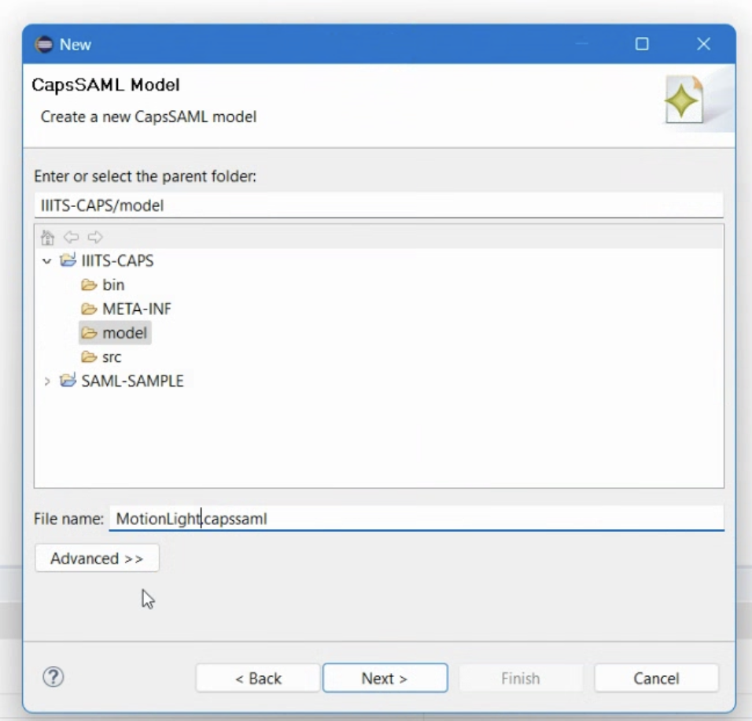](http://smartcitylivinglab.iiit.ac.in:4000/uploads/images/gallery/2025-05/image-1746137067317.png)
5. Click `Next`, select `Software Architecture` from the model object list, and click `Finish`.[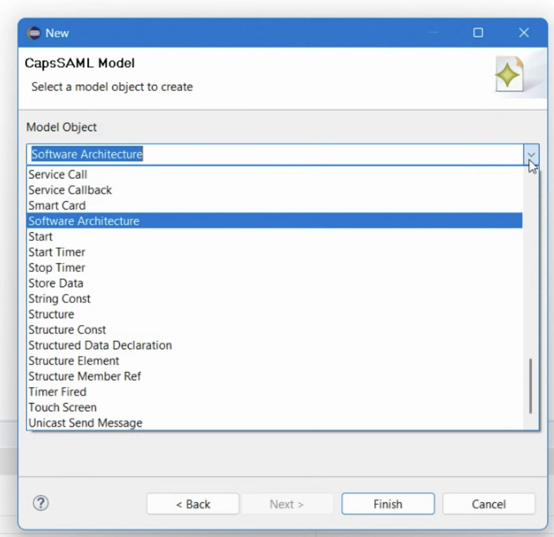](http://smartcitylivinglab.iiit.ac.in:4000/uploads/images/gallery/2025-05/image-1746137098086.png)

#### 3. Initialize the Diagram

1. In the **Project Explorer**, right-click on the new `.capssaml` file.
2. Select `Initialize friends diagram file`.[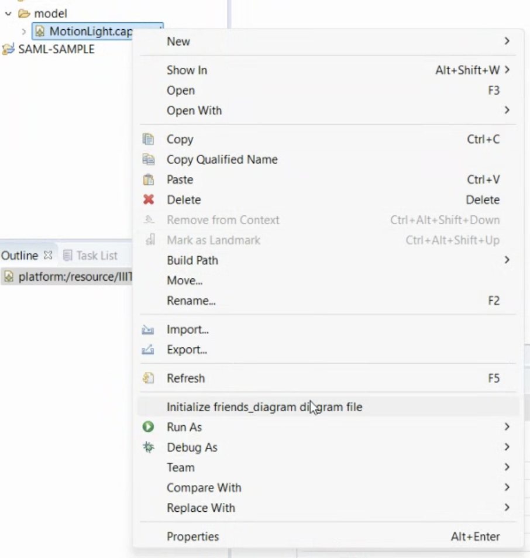](http://smartcitylivinglab.iiit.ac.in:4000/uploads/images/gallery/2025-05/image-1746137125141.png)
3. Keep the default name and location, and click `Finish`.
4. The diagram editor will open with an empty canvas.

#### 4. Creating Components

**1. Motion Sensor:**

- From the palette, select `Component` and place it on the canvas.[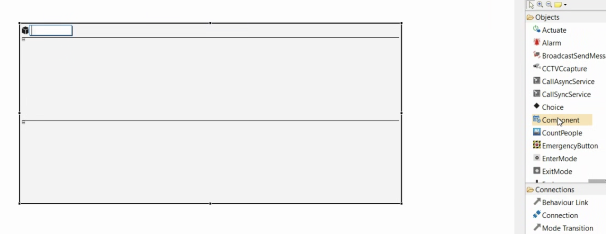](http://smartcitylivinglab.iiit.ac.in:4000/uploads/images/gallery/2025-05/image-1746139069222.png)
- In the **Properties** view, name it `MotionSensor`.[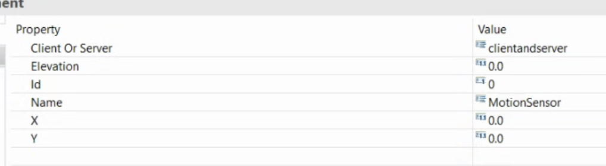](http://smartcitylivinglab.iiit.ac.in:4000/uploads/images/gallery/2025-05/image-1746139098686.png)
- Inside the component, add: 
    - `Initial Mode` (to define its starting behavior).[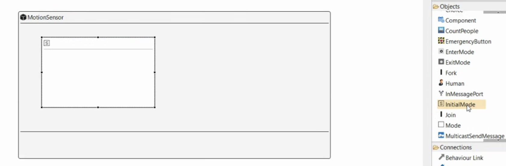](http://smartcitylivinglab.iiit.ac.in:4000/uploads/images/gallery/2025-05/image-1746139146923.png)
    - `StartTimer` (to trigger periodic temperature readings).
    - `SenseOccupancy` (to simulate temperature sensing).
    - `TimerFired` (to handle the timer expiration event).
    - `UnicastSendMessage` (to send the motion data).
    - [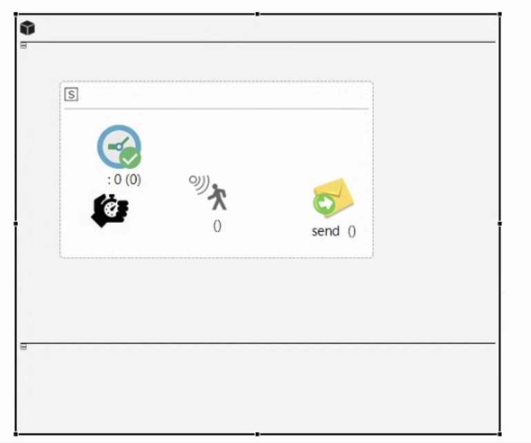](http://smartcitylivinglab.iiit.ac.in:4000/uploads/images/gallery/2025-05/image-1746140573477.png)
- Connect these elements using `Behavior Link`.[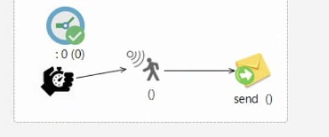](http://smartcitylivinglab.iiit.ac.in:4000/uploads/images/gallery/2025-05/image-1746140598596.png)
- Set **StartTimer Properties**: 
    - `Cyclic` → `True`
    - `Name` → `MotionTimer`
    - `Period` → `1000` (milliseconds, i.e., every 1 second)[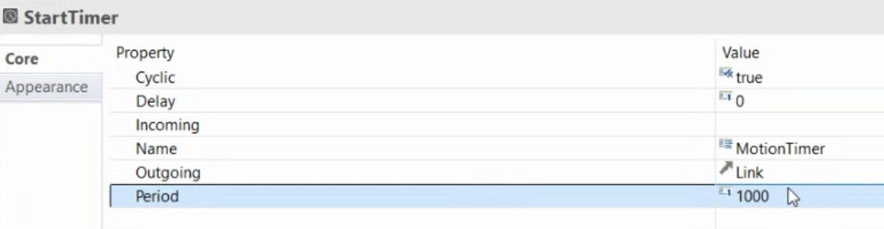](http://smartcitylivinglab.iiit.ac.in:4000/uploads/images/gallery/2025-05/image-1746139388768.png)
- Define `Primitive Data Declaration`: 
    - `Name` → `MotionData`
    - `Type` → `Boolean`
    - `Value` → `0`
- ``[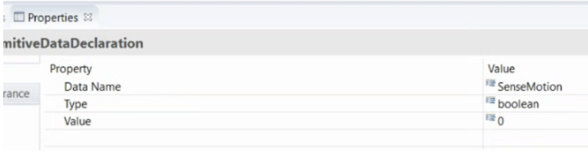](http://smartcitylivinglab.iiit.ac.in:4000/uploads/images/gallery/2025-05/image-1746140619619.png)
- Select the `SenseOccupancy` item and, in the properties view, set the following parameters.
    
    
    - Data Recipient →Double click and select the Motion Data
    - Name →SenseMotion
        
        [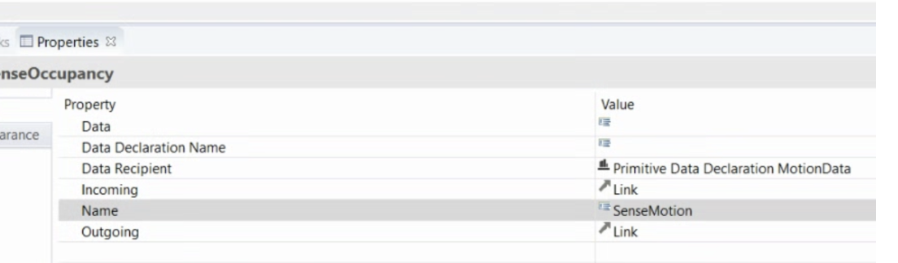](http://smartcitylivinglab.iiit.ac.in:4000/uploads/images/gallery/2025-05/image-1746140631320.png)
- Select the message item and set the following parameters: 
    - Data →MotionData;
    - Data Recipient →Select the Primitive Data Declaration MotionData variable;
    - Name →MotionValue [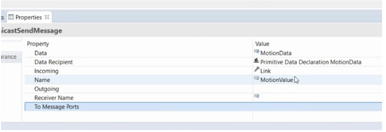](http://smartcitylivinglab.iiit.ac.in:4000/uploads/images/gallery/2025-05/image-1746140640851.png)

Now add one OutMessagePort and connect the send MotionValue to the outport using the Send Message Port. You will see something similar to this at this moment:

[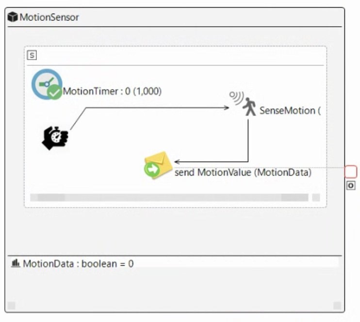](http://smartcitylivinglab.iiit.ac.in:4000/uploads/images/gallery/2025-05/image-1746141750619.png)

**2. Controller/Router**

- Create a `Component` named `Controller`.
- Inside, add: 
    - `Initial Mode`
    - `ReceiveMessage` (to get motion data from the sensor)
    - `Choice` (to implement decision-making logic)
    - Two `UnicastSendMessage` instances (to send `On` or `Off` commands)
- Define `Primitive Data Declaration`: 
    - `Name` → `Off`, `Type` → `Boolean`, `Value` → `False`
    - `Name` → `On`, `Type` → `Boolean`, `Value` → `True`
- Select the message item and set the following parameters for one: 
    - Data →Off;
    - Data Recipient →Select the Primitive Data Declaration Off
    - Name →SendOff
- Select the message item and set the following parameters for second: 
    - Data →On;
    - Data Recipient →Select the Primitive Data Declaration On
    - Name →SendOn
- Connect elements with `Behavior Link`: 
    - `ReceiveMessage` → `Choice`
    - `Choice` → `SendOnMessage` (if motion==1)
    - `Choice` → `SendOffMessage` (if motion==0)
- Add the InMessagePort, connect to the Receive MotionValue using the ReceiveMessage Port, and 2 OutMessagePorts, and connect them to the UniCastSendMessage

[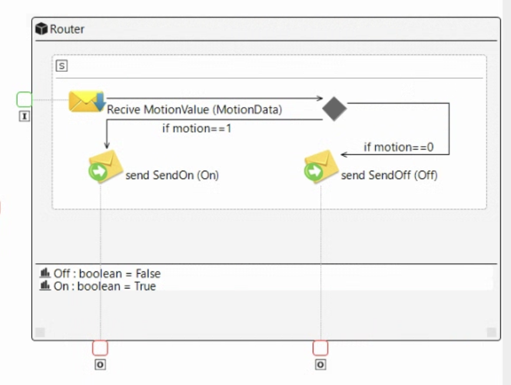](http://smartcitylivinglab.iiit.ac.in:4000/uploads/images/gallery/2025-05/image-1746141801291.png)

**3**.**Sensor/Light**

- Create a `Component` named `Light`.
- - Inside, add: 
        - `Initial Mode`
        - Two `ReceiveMessage` instances (one for `On`, one for `Off`)
        - `Actuate` (to control the window mechanism)
    - Connect elements with `Behavior Link`: 
        - `ReceiveOpenMessage` → `Actuate` (if 1 = True)
        - `ReceiveCloseMessage` → `Actuate` (if 0 = False)
- Now add two InMessagePorts and connect them to the two ReciveMessage using the ReceiveMessagePort[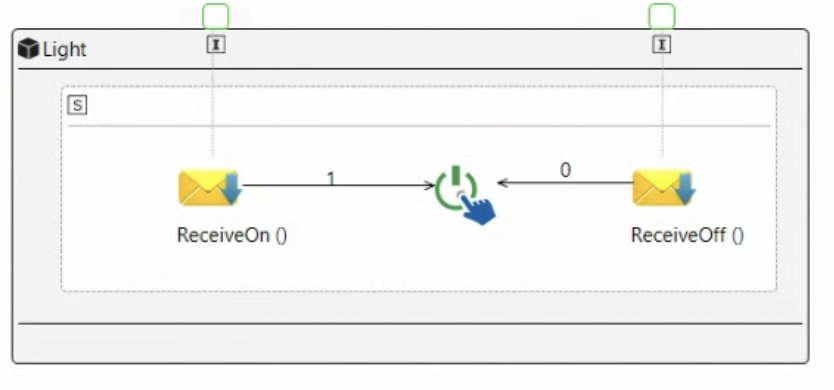](http://smartcitylivinglab.iiit.ac.in:4000/uploads/images/gallery/2025-05/image-1746142525135.png)

**4. Final Connections**

- Use `OutMessagePort` and `InMessagePort` to link using the Connection 
    - MotionSensor -&gt; Router
    - Router(SendOn) to Light(ReceiveOn)
    - Router(SendOff) to Light(ReceiveOff)

**Final Diagram:**

[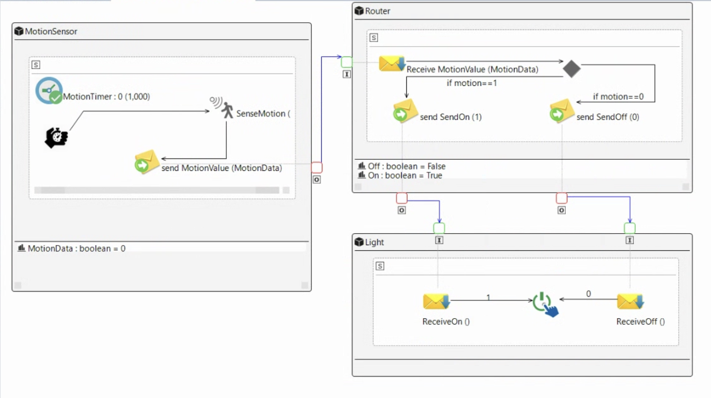](http://smartcitylivinglab.iiit.ac.in:4000/uploads/images/gallery/2025-05/image-1746142693670.png)

Save it and now, open the File in VSCode or in any code editor to see the XML file generated.